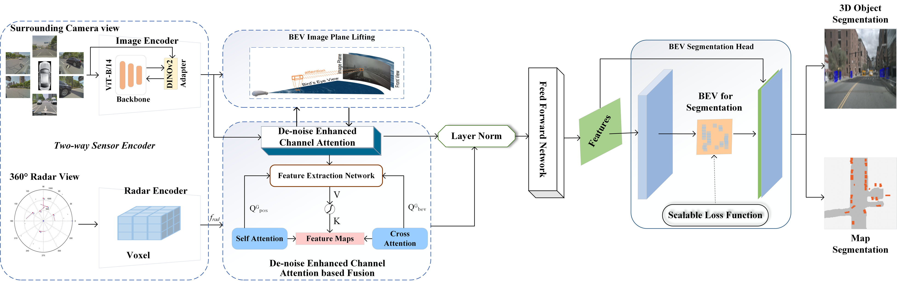

# Enhanced BEV Scene Segmentation: De-Noise Channel Attention for Resource-Constrained Environments

**ECABEV: Enhanced Channel Attention Bird's Eye View**

Argho Dey, Yunfei Yin\*, Zheng Yuan, Zhiwen Zeng, Xianjian Bao, Md Minhazul Islam

*Computers, Materials & Continua*, 2025 — DOI: [10.32604/cmc.2025.074122](https://doi.org/10.32604/cmc.2025.074122)


---

ECABEV is a lightweight camera–radar Bird's-Eye-View (BEV) scene-segmentation
model designed for **resource-constrained** autonomous-driving hardware. It
tackles three practical problems that hurt BEV fusion on low-end GPUs: noisy
camera data, high memory/compute cost, and severe class imbalance. On nuScenes,
ECABEV reaches an **IoU of 39.961** with a frozen **DINOv2 ViT-B/14** backbone at
a low **224 × 224** resolution, while using ~71.7% fewer parameters and ~55.9%
less memory than the BEVCar baseline.

<div align="center">
  
</div>


## ✨ Key contributions

1. **De-Noise Enhanced Channel Attention** — a dual-pooling (global average +
   global max) channel-attention module with a shared MLP and sigmoid gate that
   suppresses camera noise while preserving discriminative features. Applied to
   the camera BEV features inside the fusion block.
   → `nets/ecabev_modules.py::DeNoiseEnhancedChannelAttention`

2. **Bilinear Interpolation Layer Normalization** — a normalization/fusion module
   (paper Algorithm 1) that bilinearly resizes radar features, channel-aligns and
   layer-normalizes both modalities, concatenates them, and refines the result
   with depth-wise separable convolutions to keep spatial fidelity at lower cost.
   → `nets/ecabev_modules.py::BilinearInterpolationLayerNorm`

3. **Scalable Cross-Entropy (SCE) BEV Loss** — a bucket-based loss that computes
   the objective only over the hardest representatives per spatial bucket,
   handling nuScenes class imbalance efficiently (paper Eqs. 2–3).
   → `nets/ecabev_modules.py::ScalableCrossEntropyBEVLoss`

These are integrated into the two-way (camera + radar) transformer fusion network
`nets/segnet_ecabev.py::SegnetECABEV`.

## 🧭 Repository layout

```
ECABEV/
├── configs/
│   ├── train/train_ecabev.yaml     # main training config (ViT-B/14, 224x224)
│   ├── eval/eval_ecabev.yaml       # evaluation config
│   └── vis/vis_ecabev.yaml         # qualitative visualization config
├── nets/
│   ├── ecabev_modules.py           # ★ the three ECABEV contributions
│   ├── segnet_ecabev.py            # ★ full ECABEV network
│   ├── voxelnet.py                 # radar (VoxelNet) encoder
│   ├── dino_v2_with_adapter/       # DINOv2 ViT backbone + adapter
│   └── ops/                        # deformable-attention CUDA op (build required)
├── utils/                          # geometry / voxel / misc helpers
├── tests/test_ecabev_modules.py    # CPU unit tests for the new modules
├── train.py                        # single-node (DataParallel) training
├── train_DDP.py                    # multi-GPU DistributedDataParallel training
├── eval.py                         # quantitative evaluation
├── vis_eval.py                     # qualitative visualization
├── nuscenes_data.py                # nuScenes dataloader
├── nuscenes_image_converter.py     # optional pre-scaling of images
├── custom_nuscenes_splits.py       # DAY / RAIN / NIGHT val split
└── saverloader.py                  # checkpoint I/O
```

## 💾 Data preparation

Results are reported on the [nuScenes](https://www.nuscenes.org/download) dataset.
After downloading, extract the archives to e.g. `/datasets/nuscenes`:

```
/datasets/nuscenes
    samples          # sensor data for keyframes
    sweeps           # sensor data for intermediate frames
    maps             # rasterized .png + vectorized .json map files
    v1.0-trainval    # metadata + annotations for train/val
    v1.0-test        # metadata + annotations for test
    v1.0-mini        # metadata + annotations for mini
```

Point the code to this folder via the `data_dir` argument in the
[config files](./configs). Following LSS, we use **34,149** samples for training
and **6,019** for testing.

Optionally set `use_pre_scaled_imgs: true` and a `custom_dataroot` to load
pre-scaled images and reduce per-sample I/O. Generate them with
[`nuscenes_image_converter.py`](./nuscenes_image_converter.py).

### DAY / RAIN / NIGHT val split
A custom split of the nuScenes val set for per-condition inference is provided in
[`custom_nuscenes_splits.py`](./custom_nuscenes_splits.py). Set
`do_drn_val_split: true` (already set in the eval/vis configs) to use it.

> The following Shapely deprecation warnings are expected and filtered out;
> `shapely<2.0` is pinned in `requirements.txt` for nuScenes map-API compatibility.

## ⚙️ Installation

Requirements: Linux, CUDA-capable GPU, conda.

```bash
# 1. environment
conda create --name ecabev python=3.10
conda activate ecabev
conda install pytorch=2.1.2 torchvision=0.16.2 torchaudio=2.1.2 pytorch-cuda=11.8 -c pytorch -c nvidia
conda install pip
conda install xformers -c xformers
pip install -r requirements.txt

# 2. compile the deformable-attention operators
cd nets/ops
sh ./make.sh
python test.py          # optional: verify the build
cd ../..
```

### Pre-trained backbone
ECABEV uses a **frozen DINOv2 ViT-B/14** image backbone; its weights are loaded
via the DINOv2 adapter at model-init time (see `nets/dino_v2_with_adapter`).

## 🏋️ Training

```bash
CUDA_VISIBLE_DEVICES=0 python train.py --config='configs/train/train_ecabev.yaml'
```

Multi-GPU (DistributedDataParallel):

```bash
python -m torch.distributed.run --nproc_per_node=<N> train_DDP.py \
    --config='configs/train/train_ecabev.yaml'
```

Notes:
- The default config trains at **224 × 224** on a single GPU with gradient
  accumulation (`grad_acc: 5`) to fit low-memory devices. Increase
  `device_ids`/`batch_size` for larger machines.
- Changing `exp_name` in the config creates a new folder under
  `model_checkpoints/` for that run's weights.
- Optimizer: AdamW, `lr = 3e-4`, up to 75,000 iterations (matching the paper).

### ECABEV-specific config flags
| flag | default | meaning |
|------|---------|---------|
| `use_sce_loss` | `true` | use the Scalable Cross-Entropy BEV loss for the object head (set `false` for plain BCE) |
| `sce_num_buckets` | `10` | number of spatial buckets per side for SCE |
| `sce_top_k` | `4` | hardest representatives kept per bucket |

## 📊 Evaluation

```bash
CUDA_VISIBLE_DEVICES=0 python eval.py --config='configs/eval/eval_ecabev.yaml'
```

Set `init_dir` / `load_step` in the eval config to point at your checkpoint.
Metric: mean Intersection-over-Union (mIoU) over all segmentation categories.

## 🖼️ Visualization

```bash
CUDA_VISIBLE_DEVICES=0 python vis_eval.py --config='configs/vis/vis_ecabev.yaml'
```

## 🔬 Results (nuScenes)

| Method | Inputs | Backbone | Res. | IoU |
|--------|--------|----------|------|-----|
| BEVDepth | Camera | ResNet-50 | 224² | 33.422 |
| SimpleBEV | Camera | ResNet-101 | 224² | 32.165 |
| CVT | Camera | EfficientNet | 224² | 30.854 |
| CRN | Camera+Radar | ResNet-50 | 224² | 39.403 |
| BEVCar | Camera+Radar | ResNet-101 | 224² | 39.636 |
| **ECABEV (ours)** | Camera+Radar | **ViT-B/14** | 224² | **39.961** |

Resource footprint (Camera+Radar): ECABEV (ViT-B/14) uses **38.70 M** params and
**10.58 G** memory, vs. BEVCar's 136.77 M / >24 G.

Ablation (component removal, IoU): full **39.961**; −CA 38.247; −BLN 38.893;
−SCE-BEV 37.612.

Reproduce the module-level sanity checks:

```bash
python -m pytest tests/test_ecabev_modules.py -v
# or:  python tests/test_ecabev_modules.py
```

## 🙏 Acknowledgment

ECABEV builds on the excellent [**BEVCar**](https://github.com/robot-learning-freiburg/BEVCar)
codebase (Schramm et al., IROS 2024) and reuses components from DINOv2,
Deformable-DETR, BEVFormer, and SimpleBEV. See [`NOTICE`](./NOTICE) for details.

## 📝 Citation

If you find ECABEV useful, please cite:

```bibtex
@article{dey2025ecabev,
  title   = {Enhanced BEV Scene Segmentation: De-Noise Channel Attention for Resource-Constrained Environments},
  author  = {Dey, Argho and Yin, Yunfei and Yuan, Zheng and Zeng, Zhiwen and Bao, Xianjian and Islam, Md Minhazul},
  journal = {Computers, Materials \& Continua},
  year    = {2025},
  doi     = {10.32604/cmc.2025.074122}
}
```

Please also cite the BEVCar baseline:

```bibtex
@inproceedings{schramm2024bevcar,
  title     = {{BEVCar}: Camera-Radar Fusion for {BEV} Map and Object Segmentation},
  author    = {Schramm, Jonas and V{\"o}disch, Niclas and Petek, K{\"u}rsat and Kiran, B Ravi and Yogamani, Senthil and Burgard, Wolfram and Valada, Abhinav},
  booktitle = {IROS},
  year      = {2024}
}
```

## 👩‍⚖️ License

Released under **CC BY-NC-SA 4.0**, inherited from the BEVCar baseline
(ShareAlike). See [`LICENSE`](./LICENSE) and [`NOTICE`](./NOTICE).
